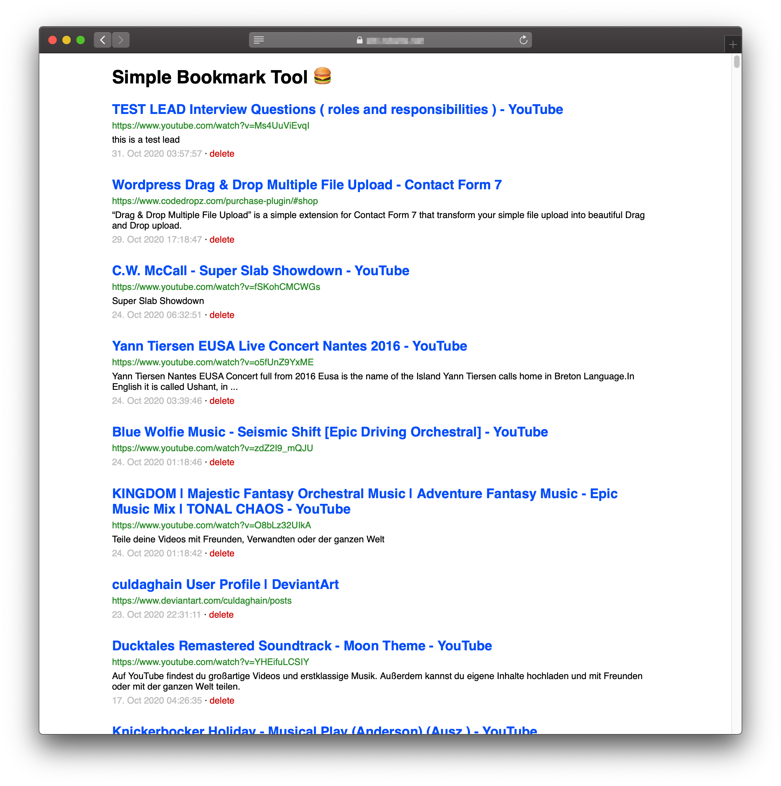

# Simple Bookmark Tool

Add bookmarks with a bookmarklet and show them in a list. Also:

- Works on github and other pages with Content Security Policy
- Import Netscape Bookmark HTML files
- Select text before bookmarking to use as description
- One single PHP file, no dependencies, Google Page Speed Score of 100 (if you have < ~400 bookmarks :>)

## Install
- Have PHP (with openssl extension) and MySQL
- Create database
- Edit your data in the config array or an external config.php
- Upload sbt.php
- Click on hamburger menu and add bookmarklet

## FAQ

### Why no pagination, search, tags, thumbnails, website mirror, ...?

As I used [historio.us](https://historio.us) and [pinboard.in](https://pinboard.in/) it turned out, that I don't use most of these features, even with ~2000 bookmarks. If you need them, try out those services.
